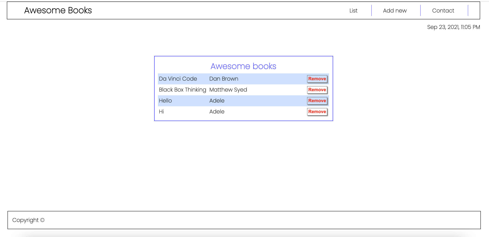

# Awesome books

> This is a library project with a great UX and a beautiful UI.

Additional description about the project and its features.

## Built With

- HTML
- CSS
- Javascript
- Technologies used

[Live Demo Link](https://abrormukimov.github.io/awesome-lib/)

## Getting Started

This project can be used to store books in the online library. Users can enter the title and the author of a book. Also, it allows users to remove books from the library.

To get a local copy up and running follow these simple example steps.

### Prerequisites

### Setup

### Install

### Usage

### Run tests

### Deployment

## Author

- GitHub: [@abrormukimov](https://github.com/abrormukimov)
- Twitter: [@abrormukimov](https://twitter.com/abrormukimov)
- LinkedIn: [AbrorMukimov](https://www.linkedin.com/in/abror-mukimov/)

## 🤝 Contributing

Contributions, issues, and feature requests are welcome!

Feel free to check the [issues page](https://github.com/abrormukimov/awesome-lib/issues).

## Show your support

Give a ⭐️ if you like this project!

## Acknowledgments

- Hat tip to anyone whose code was used
- Inspiration
- etc

## 📝 License

This project is [MIT](./MIT.md) licensed.